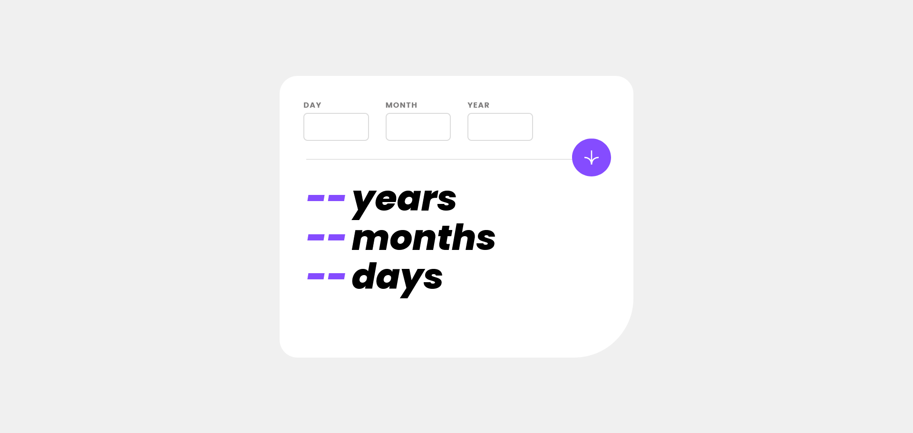

# Frontend Mentor - Age calculator app solution

This is a solution to the [Age calculator app challenge on Frontend Mentor](https://www.frontendmentor.io/challenges/age-calculator-app-dF9DFFpj-Q). Frontend Mentor challenges help you improve your coding skills by building realistic projects.

## Table of contents

-   [Overview](#overview)
    -   [The challenge](#the-challenge)
    -   [Screenshot](#screenshot)
    -   [Links](#links)
-   [My process](#my-process)
    -   [Built with](#built-with)
    -   [What I learned](#what-i-learned)
    -   [Continued development](#continued-development)
    -   [Useful resources](#useful-resources)
-   [Author](#author)
-   [Acknowledgments](#acknowledgments)

## Overview

### The challenge

Users should be able to:

-   View an age in years, months, and days after submitting a valid date through the form
-   Receive validation errors if:
    -   Any field is empty when the form is submitted
    -   The day number is not between 1-31
    -   The month number is not between 1-12
    -   The year is in the future
    -   The date is invalid e.g. 31/04/1991 (there are 30 days in April)
-   View the optimal layout for the interface depending on their device's screen size
-   See hover and focus states for all interactive elements on the page
-   **Bonus**: See the age numbers animate to their final number when the form is submitted

### Screenshot



### Links

-   Solution URL: [Add solution URL here](https://github.com/jwren4170/age-calculator)
-   Live Site URL: [Add live site URL here](https://age-calculator-blush.vercel.app/)

## My process

### Built with

-   Semantic HTML5 markup
-   Sass
-   CSS custom properties
-   Flexbox
-   CSS Grid
-   Mobile-first workflow

### What I learned

I learned how to use sass in a project and quite a bit about sass along the way.

I am particularly proud of my use of mixins

```scss
@use '../abstracts/colors' as *;
@use '../abstracts/functions' as *;

@mixin error-styles {
	.card__header {
		&--label {
			color: var(--light-red);
		}
		&--input[type='text'] {
			border: rems(2) solid var(--light-red);
		}
		&--error {
			visibility: visible;
			color: var(--light-red);
			font-size: rems(1);
			white-space: nowrap;
		}
	}
}

@mixin success-styles {
	.card__header {
		&--label {
			color: var(--green);
		}
		&--input[type='text'] {
			border: rems(2) solid var(--green);
		}
	}
}
```

### Continued development

I plan on doing more challenges that are javascript heavy. I need work on that. I sure a pro could have done
the js files in a better way.

Also I want to try using postcss in my next project so I can use container queries and other future css styling.

### Useful resources

-   As per usual I watch a lot of youtube videos to learn. Favorites are Kevin Powell, Kyle Simpson, Brad Traversy
-   and many othersl
-   Also have used Udemy.com to buy some courses.

## Author

-   Frontend Mentor - [@jwren4170](https://www.frontendmentor.io/profile/jwren4170)
